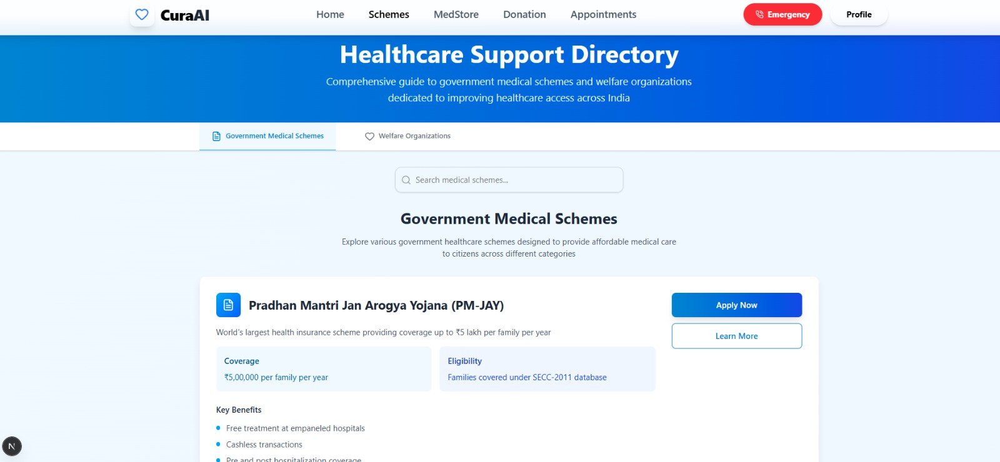
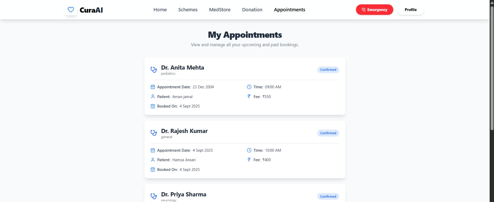
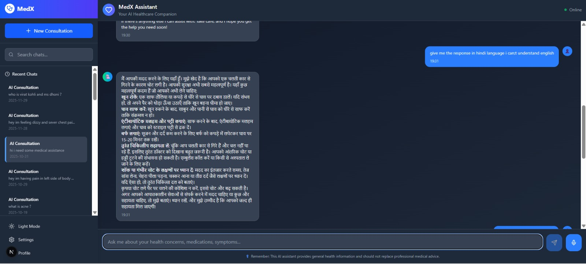

# 🩺 CuraAI — Agentic Healthcare Assistant  
### Autonomous AI for Symptom Triage, Report Analysis & Healthcare Decision-Making  

CuraAI is an **Agentic AI–powered healthcare assistant** that helps users make better health decisions by:

- Understanding symptoms in natural language  
- Triaging the severity (low / medium / high / critical)  
- Explaining lab reports in simple language  
- Suggesting next actions (self-care, doctor visit, emergency)  
- Connecting users to nearby facilities and services  

Built as part of **MumbaiHacks 2025** under the **Agentic AI** theme.

> ⚠️ **Medical Disclaimer:** CuraAI is a prototype for educational and assistive purposes only.  
> It is **not** a replacement for professional medical advice, diagnosis, or treatment.

---

## 🚨 Problem

People face serious challenges in everyday healthcare:

- No **instant guidance** when symptoms appear  
- **Overloaded hospitals** with non-urgent cases  
- Confusing **lab reports** that patients cannot interpret  
- Limited **awareness of severity** – when to relax vs when to rush  
- Rural and semi-urban regions with **limited access** to doctors  

There is a clear need for an **always-available, intelligent assistant** that can guide users **before** they reach the hospital.

---

## 💡 Our Solution — CuraAI

CuraAI acts as a **24×7 digital health companion**:

- Chats with users in natural language about their symptoms  
- Uses an **agentic pipeline** to analyze context and history  
- Helps users understand their lab reports and medical documents  
- Suggests nearby hospitals, pharmacies and health facilities  
- Helps book appointments and store medical records  

Instead of being just a chatbot, **CuraAI is structured as multiple cooperating agents**.

---

## 🤖 Why Agentic AI?

Traditional chatbots simply reply to messages.  
**Agentic AI systems can:**

1. **Reason** over user data and medical knowledge  
2. **Plan** multi-step actions toward a goal  
3. **Take actions** like triaging, booking, recommending facilities  
4. **Maintain state** across the user’s journey  

CuraAI follows the **Perception → Reasoning → Planning → Action** loop, implemented through multiple conceptual agents.

---

## 🧩 Agent Architecture (Conceptual)

CuraAI is organized into **five core agents**:

1. **Symptom Analysis Agent**  
   - Takes user symptoms and follow-up answers  
   - Assesses urgency and generates a **triage score**

2. **Medical Knowledge Agent**  
   - Uses LLM-style reasoning over general medical knowledge  
   - Explains likely causes, basic precautions, and when to worry

3. **Report Understanding Agent**  
   - Helps users interpret lab reports (CBC, lipid profile, etc.)  
   - Highlights abnormal values and explains them in simple terms

4. **Hospital Recommendation Agent**  
   - Connects symptoms + severity with **nearby hospitals, pharmacies, and facilities**

5. **Action & Planning Agent**  
   - Converts analysis into concrete steps:  
     - self-care at home  
     - doctor consultation  
     - emergency care  
   - Manages bookings and user records

---

## 🔗 Agent-to-Code Mapping (Implementation View)

Even though CuraAI is designed as a multi-agent system conceptually, each agent is backed by **real Next.js pages, components, models and API routes**.

### 🩻 1. Symptom Analysis Agent  
**Role:** Entry point – chat with user and perform triage.

- UI:
  - `src/pages/chatbot.js`
  - `src/components/Services.jsx`
  - `src/components/Hero.jsx`
- Backend/API:
  - `src/pages/api/botreply.js`
  - `src/pages/api/get-messages.js`
- Data model:
  - `src/models/Chat.js`

This flow manages symptom conversation, stores messages, and forms the base for triage.

---

### 🧠 2. Medical Knowledge Agent  
**Role:** Provide health education, explanations and reasoning.

- UI:
  - `src/pages/virtualAssistantCard.js`
  - `src/components/FAQ.jsx`
  - `src/components/HealthArticles.jsx`
- Backend/API:
  - Shares reasoning endpoint with `src/pages/api/botreply.js`

This agent powers Q&A, FAQs and educational content based on user queries.

---

### 📄 3. Report Understanding Agent  
**Role:** Help users understand medical documents and lab reports.

- UI:
  - `src/components/ReportAnalysisApp.jsx`
  - `src/pages/reportanalyse.jsx`
- Backend/API:
  - `src/pages/api/upload.js`
  - `src/pages/api/document.js`
- Data model:
  - `src/models/Document.js`

Handles upload, storage and early-stage analysis pipeline for reports.

---

### 🏥 4. Hospital Recommendation Agent  
**Role:** Bridge users to the healthcare ecosystem.

- UI:
  - `src/pages/mapfacility.jsx`
  - `src/components/Healthfacility.jsx`
  - `src/pages/pharmacy.js`
  - `src/components/MedStore.jsx`
- Logic:
  - Uses location and facility data to show clinics, hospitals and pharmacies.

---

### 📅 5. Action & Planning Agent  
**Role:** Turn insights into actions for the user.

- Appointment & booking:
  - UI:
    - `src/components/Appointment.jsx`
    - `src/pages/appoint.jsx`
    - `src/pages/userappoint.jsx`
  - Backend/API:
    - `src/pages/api/book-appointment.js`
  - Model:
    - `src/models/Booking.js`
- User identity & vault:
  - UI: `src/pages/login.js`, `src/pages/register.js`, `src/pages/medicalVault.js`
  - APIs: `src/pages/api/login.js`, `src/pages/api/register.js`, `src/pages/api/check-auth.js`
  - Models: `src/models/User.js`
- This completes the **perception → reasoning → action** loop by enabling logged-in care journeys.

---

## 🔁 High-Level Workflow

```text
1. User opens CuraAI (home / chatbot / virtual assistant)
2. Symptom Analysis Agent collects symptoms & questions
3. Medical Knowledge Agent reasons about the condition
4. (Optional) Report Understanding Agent processes uploaded reports
5. Hospital Recommendation Agent prepares nearby facility options
6. Action & Planning Agent suggests:
     - self-care OR
     - book appointment OR
     - go to emergency
7. User can book, store records and continue follow-up conversations
```

## ✨ Key Features

Natural language virtual health assistant

Symptom triage and guidance

Report upload & basic analysis workflow

Mapping of nearby hospitals, pharmacies and health facilities

Medical vault for documents

Appointment booking and user management

Clean, responsive UI suitable for web deployment

## 🛠 Tech Stack

Frontend: Next.js (Pages Router), React

UI: Tailwind CSS, custom components (src/components/ui)

Backend: Next.js API routes (Node.js)

Database: MongoDB (via models in src/models)

Media Storage: Cloudinary integration (src/lib/cloudinary.js)

Other utilities: Custom helpers in src/lib/utils.js

## 📁 Repository Structure

```text
curaai-agentic-healthcare-assistant/
├─ docs/                         # Architecture diagrams, documentation
│  └─ ARCHITECTURE.md
│
├─ prompts/                      # LLM / agent prompts (conceptual)
│  └─ symptom-agent-prompt.md
│
├─ public/                       # Public assets
│
├─ src/
│  ├─ components/
│  │  ├─ ui/
│  │  │  ├─ accordion.jsx
│  │  │  ├─ button.jsx
│  │  │  └─ card.jsx
│  │  ├─ Appointment.jsx
│  │  ├─ FAQ.jsx
│  │  ├─ Footer.jsx
│  │  ├─ Header.jsx
│  │  ├─ HealthArticles.jsx
│  │  ├─ Healthfacility.jsx
│  │  ├─ Hero.jsx
│  │  ├─ MedStore.jsx
│  │  ├─ ReportAnalysisApp.jsx
│  │  ├─ SecurityBanner.jsx
│  │  ├─ Services.jsx
│  │  └─ Videoconsult.jsx
│  │
│  ├─ lib/
│  │  ├─ cloudinary.js
│  │  ├─ mongodb.js
│  │  └─ utils.js
│  │
│  ├─ models/
│  │  ├─ Booking.js
│  │  ├─ Chat.js
│  │  ├─ Document.js
│  │  └─ User.js
│  │
│  ├─ pages/
│  │  ├─ api/
│  │  │  ├─ book-appointment.js
│  │  │  ├─ botreply.js
│  │  │  ├─ chats.js
│  │  │  ├─ check-auth.js
│  │  │  ├─ document.js
│  │  │  ├─ get-chathistory.js
│  │  │  ├─ get-messages.js
│  │  │  ├─ hello.js
│  │  │  ├─ login.js
│  │  │  ├─ messages.js
│  │  │  ├─ register.js
│  │  │  ├─ send-message.js
│  │  │  └─ upload.js
│  │  │
│  │  ├─ appoint.jsx
│  │  ├─ chatbot.js
│  │  ├─ donation.jsx
│  │  ├─ home.jsx
│  │  ├─ index.js
│  │  ├─ login.js
│  │  ├─ mapfacility.jsx
│  │  ├─ medicalVault.js
│  │  ├─ pharmacy.js
│  │  ├─ register.js
│  │  ├─ reportanalyse.jsx
│  │  ├─ schemes.jsx
│  │  ├─ userappoint.jsx
│  │  ├─ video.jsx
│  │  ├─ virtualAssistantCard.js
│  │  ├─ _app.js
│  │  └─ _document.js
│  │
│  └─ styles/
│     └─ globals.css
│
├─ README.md
├─ package.json
├─ next.config.mjs
```
## 📸 Demo Screenshots

### 🏠 Home Page


### 🤖 Chatbot (Symptom Analysis)


### 📂 Medical Vault


### 🏥 Govt Schemes


### 📅 Appointments


### 🌐 Multilingual Support


## 🚀 Getting Started (Development)
# Install dependencies
npm install

# Start the development server
npm run dev


The app will be available at:
👉 http://localhost:3000

## 🔮 Future Enhancements

Stronger triage models and explainable AI for risk scoring
Offline / low-connectivity mode for rural areas
Integration with wearables (heart rate, SpO₂, BP)
Doctor dashboard for second-level review
Multi-language support for Indian regional languages
Integration with telemedicine platforms and government health schemes

## 🏥 Impact

By combining Agentic AI with a practical healthcare workflow, CuraAI aims to:
Reduce unnecessary hospital visits
Encourage earlier decision-making for serious cases
Improve accessibility for patients in remote areas
Support doctors by filtering basic queries


